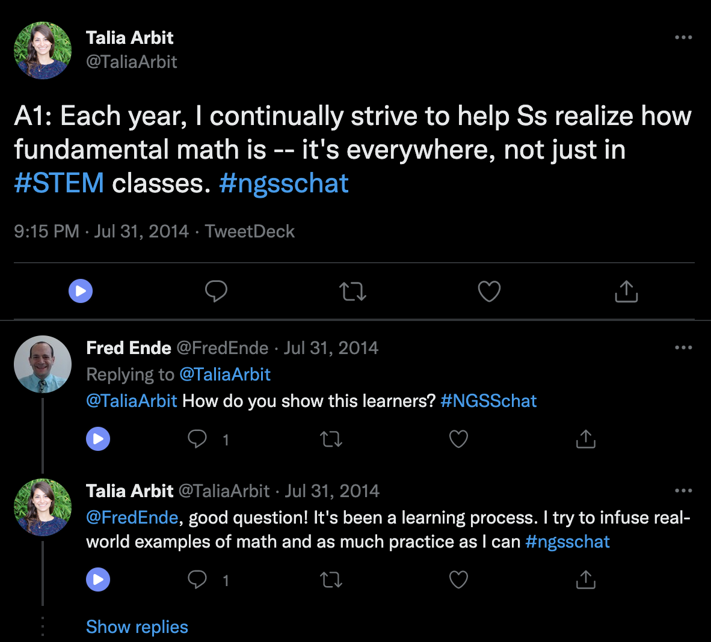
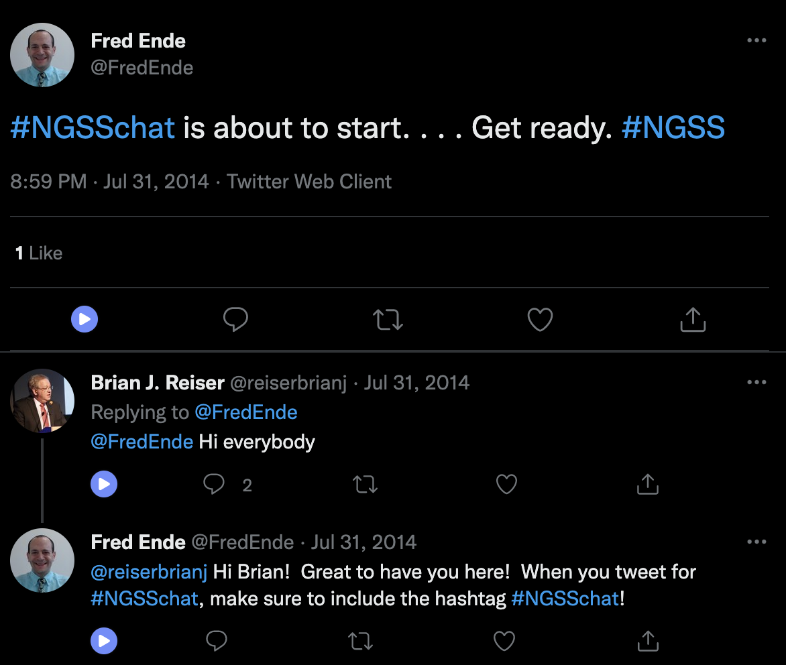
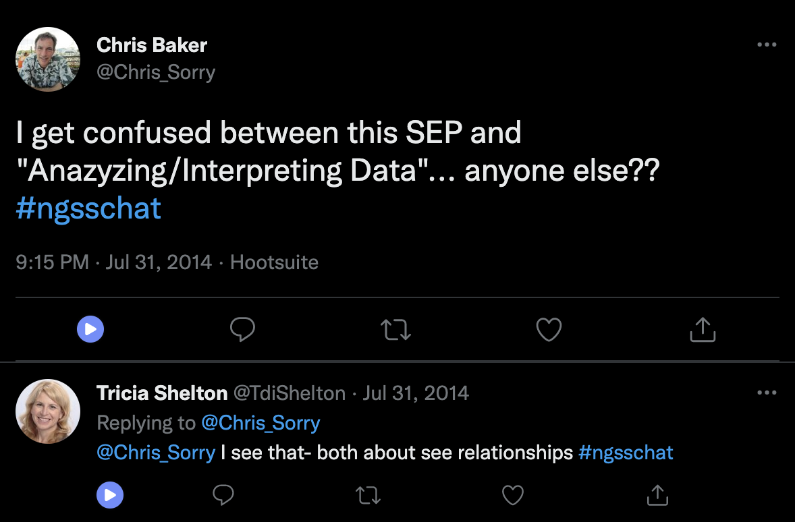

class: clear, title-slide, inverse, center, top, middle

```{r setup, include=FALSE}
knitr::opts_chunk$set(echo = FALSE)
```

```{r, echo=FALSE}
# then load all the relevant packages
pacman::p_load(pacman, knitr, tidyverse, readxl)
```

```{r xaringan-panelset, echo=FALSE}
xaringanExtra::use_panelset()
```

```{r xaringanExtra-clipboard, echo=FALSE}
# these allow any code snippets to be copied to the clipboard so they 
# can be pasted easily
htmltools::tagList(
  xaringanExtra::use_clipboard(
    button_text = "<i class=\"fa fa-clipboard\"></i>",
    success_text = "<i class=\"fa fa-check\" style=\"color: #90BE6D\"></i>",
  ),
  rmarkdown::html_dependency_font_awesome()
)
```
```{r xaringan-extras, echo=FALSE}
xaringanExtra::use_tile_view()

```

# `r rmarkdown::metadata$title`
----
### `r rmarkdown::metadata$author`
### `r format(Sys.time(), "%B %d, %Y")`

---

# Background

- We have some data, but we want to use a computer to **automate** or scale up the relationships between predictor (independent) and outcome (dependent) variables. Supervised machine learning is suited to this aim.  
- We use *data from a large, social media-based community focused on supporting the implementation of the Next Generation Science Standards, #NGSSchat on Twitter*.   
- Using 1000s of qualitative codes from two years of the chat, we explore how well a computer can scale up this coding.
Conceptually, we focus on understanding how prediction differs from explanation and why it is essential to split our data for supervised machine learning into "training" and "testing" sets.  

---

# Agenda

.pull-left[
## Part 1: Core Concepts
### Prediction
- Prediction versus explanation
- Train and test set
]

.pull-right[

## Part 2: R Code Examples
### #NGSSchat data
- Estimating a logistic regression model
- Interpreting the model in terms of its predictive accuracy
]

---

class: clear, inverse, center, middle

# Core Concepts

---

# A brief review

What are the differences between supervised and unsupervised machine learning?

.pull-left[

## Supervised ML

- Requires a known outcome (a _y_ variable)
- Useful for _automating_ or _scaling up_ data with a known outcome

]

.pull-right[

## Unsupervised ML 

- Useful for _identifying groups or patterns in data_
- Can be used in concert with qualitative methods

]

---

# Supervised & unsupervised

## Supervised ML

- Requires coded data or data with a known outcome
- Uses coded/outcome data to train an algorithm
- Uses that algorithm to **predict the codes/outcomes for new data** (data not used during the training)
- Can take the form of a *classification* (predicting a dichotomous or categorical outcome) or a *regression* (predicting a continuous outcome)

---

# What kind of coded data?

> Want to detect spam? Get samples of spam messages. Want to forecast stocks? Find the price history. Want to find out user preferences? Parse their activities on Facebook (no, Mark, stop collecting it, enough!) (from [ML for Everyone](https://vas3k.com/blog/machine_learning/))

In educational research:

- Assessment data (e.g., [1](https://link.springer.com/article/10.1007/s10956-020-09895-9))
- Data from log files ("trace data") (e.g., [1](https://www.tandfonline.com/doi/full/10.1080/10508406.2013.837391?casa_token=-8Fm2KCFJ30AAAAA%3Altbc8Y8ci_z-uLJx4se9tgvru9mzm3yqCTFi12ndJ5uM6RDl5YJGG6_4KpUgIK5BYa_Ildeh2qogoQ))
- Open-ended written responses (e.g., [1](https://link.springer.com/article/10.1007/s10956-020-09889-7), [2](https://doi.org/10.1007/s11423-020-09761-w))
- Achievement data (i.e., end-of-course grades) (e.g., [1](https://link.springer.com/article/10.1007/s10956-020-09888-8), [2](https://search.proquest.com/docview/2343734516?pq-origsite=gscholar&fromopenview=true))
- What else?

---

# How is this different from regression?

The _aim_ is different, the algorithms and methods of estimation are not (or, are differences in degree, rather than in kind).

In a linear regression, our aim is to estimate parameters, such as $\beta_0$ (intercept) and $\beta_1$ (slope), and to make inferences about them that are not biased by our particular sample.

In an ML approach, we can use the same linear regression model, but with a goal other than making unbiased inferences about the $\beta$ parameters:

**In supervised ML, our goal is to minimize the difference between a known $y$ and our predictions, $\hat{y}$**

---

# A helpful frame 

## Unsupervised ML

- Does not require coded data; one way to think about unsupervised ML is that its purpose is to discover codes/labels
- Is used to discover groups among observations/cases or to summarize across variables
- Can be used in an _exploratory mode_ (see [Nelson, 2020](https://journals.sagepub.com/doi/full/10.1177/0049124118769114?casa_token=EV5XH31qbyAAAAAA%3AFg09JQ1XHOOzlxYT2SSJ06vZv0jG-s4Qfz8oDIQwh2jrZ-jrHNr7xZYL2FwnZtZiokhPalvV1RL2Bw)) 
- **Warning**: The results of unsupervised ML _cannot_ directly be used to provide codes/outcomes for supervised ML techniques 

---

# What technique should I choose?

Do you have coded data or data with a known outcome -- let's say about K-12 students -- and, do you want to:

- _Predict_ how other students with similar data (but without a known outcome) perform?
- _Scale_ coding that you have done for a sample of data to a larger sample?
- _Provide timely or instantaneous feedback_, like in many learning analytics systems?

<bold><h4><center>Supervised methods may be your best bet</center></h4></bold>

---

# What technique should I choose?

Do you not yet have codes/outcomes -- and do you want to?

- _Achieve a starting point_ for qualitative coding, perhaps in a ["computational grounded theory"](https://journals.sagepub.com/doi/full/10.1177/0049124117729703) mode?
- _Discover groups or patterns in your data_ that may be of interest?
- _Reduce the number of variables in your dataset_ to a smaller, but perhaps nearly as explanatory/predictive - set of variables?

<bold><h4><center>Unsupervised methods may be helpful</center></h4></bold>

---

# Discussion

.pull-left[
### Turn to an elbow partner and discuss:

- Which modality (supervised or unsupervised machine learning) are you interested in using?
- What data or context are you interested in for your use of ML?
]

.pull-right[

```{r, echo = FALSE, out.width = "75%"}
knitr::include_graphics("img/joro-pointing.jpeg")
```
]

---

# What if we want to *scale* a coding frame?

```{r, out.width = "50%", fig.align='center'}
knitr::include_graphics("img/ngsschat-article.png")
```

---

# Let's look at a few examples

.pull-left[

`id_string`: 46

```{r, out.width="70%"}

```

]

.pull-right[

**How would you code this?**

We used a coding frame from [van Bommel et al. (2020)](https://www.sciencedirect.com/science/article/pii/S0742051X19300629):

- *Transactional*: A transactional interaction refers to those in which participation or learning is acknowledged.
- *Substantive*: Discussions of NGSS- and science education-related content.

]

---

# Let's look at a few examples

.pull-left[

`id_string`: 46

```{r, out.width="70%"}

```

]

.pull-right[

**We coded this as *substantive***

We used a coding frame from [van Bommel et al. (2020)](https://www.sciencedirect.com/science/article/pii/S0742051X19300629):

- *Transactional*: A transactional interaction refers to those in which participation or learning is acknowledged.
- *Substantive*: Discussions of NGSS- and science education-related content.

]

---


# Let's look at a few examples

.pull-left[

`id_string`: 30

```{r, out.width="70%"}

```

]

.pull-right[

**How would you code this?**

We used a coding frame from [van Bommel et al. (2020)](https://www.sciencedirect.com/science/article/pii/S0742051X19300629):

- *Transactional*: A transactional interaction refers to those in which participation or learning is acknowledged.
- *Substantive*: Discussions of NGSS- and science education-related content.

]

---

# Let's look at a few examples

.pull-left[
`id_string`: 30

```{r, out.width="70%"}

```

]

.pull-right[

**We coded this as *transactional***

We used a coding frame from [van Bommel et al. (2020)](https://www.sciencedirect.com/science/article/pii/S0742051X19300629):

- *Transactional*: A transactional interaction refers to those in which participation or learning is acknowledged.
- *Substantive*: Discussions of NGSS- and science education-related content.

]

---

# Let's look at a few examples

.pull-left[
`id_string`: 45

```{r, out.width="70%"}

```

]

.pull-right[

**We coded this as *substantive***

We used a coding frame from [van Bommel et al. (2020)](https://www.sciencedirect.com/science/article/pii/S0742051X19300629):

- *Transactional*: A transactional interaction refers to those in which participation or learning is acknowledged.
- *Substantive*: Discussions of NGSS- and science education-related content.

]

---

# Let's look at a few examples

.pull-left[
`id_string`: 2

```{r, out.width="70%"}
knitr::include_graphics("img/ngsschat-example-tweets_4.png")
```

]

.pull-right[

**We coded this as *transactional***

We used a coding frame from [van Bommel et al. (2020)](https://www.sciencedirect.com/science/article/pii/S0742051X19300629):

- *Transactional*: A transactional interaction refers to those in which participation or learning is acknowledged.
- *Substantive*: Discussions of NGSS- and science education-related content.

]

---

# Can we scale up?

There are *hundreds of thousands* of tweets like this in threads; practically, there's no way we could code all of them.

--

But, we did code several thousand threads

--

Can we use these to scale up our coding?

--

In other words, can the computer use the features of tweets in threads to assign them labels as *transactional* or *substantive* conversations?

---

class: clear, inverse, center, middle

# Code Examples

---

# Overview of classification modeling

These align with the LASER Framework (used across topic areas):

1.  **Prepare**: Prior to analysis, we'll take a look at the context
    from which our data came, formulate some questions, and load R packages.

2.  **Wrangle**: In the wrangling section, we will
    learn some basic techniques for manipulating, cleaning,
    transforming, and merging data.

3.  **Explore**: The processes of wrangling and exploring data often go hand in hand.

4.  **Model**: In this step, we carry out the analysis - here, supervised machine learning.

5.  **Communicate**: Interpreting and communicating the results of our findings is the last step
    
---

# Overview of classification modeling

1. **Split data** (Prepare)  
1. **Engineer features and write down the recipe** (Wrangle and Explore)  
1. **Specify the model and workflow** (Model)  
1. **Fit model** (Model)
1. **Evaluate accuracy** (Communicate)  

This is the basic process we'll follow for this and the next three learning labs focused on supervised ML

We'll dive into each of these subsequently

---

# Algorithm talk

- Algorithms (or estimation procedures - or informally models) refer to the _structure_ and _process_ of estimating the _parameters_ of a model

- This definition provides a wide range of options for what kinds of algorithms we use (from simple to very complex, as we discuss in a later learning lab)

- For now, we focus on a familiar, easy to interpret algorithm, one that is still often used in sophisticated, rigorous analyses (e.g., [1](https://dl.acm.org/doi/abs/10.1145/3448139.3448154?casa_token=skmk5XGbDOUAAAAA:Z0Kl4nyjpOGFA6RuFTiiLWaC_KxH1vkQ72Kr0hetXcumRdvu8tPYlCX12AgHr9aS0Fp3L-Uu0p4), also [this](https://linkinghub.elsevier.com/retrieve/pii/S0895435618310813)), _logistic regression_
    - This is a linear model with a binary (*"yes"* or *"no"*) outcome

---

# Classification modeling

.panelset[

.panel[.panel-name[0]

**Loading, setting up**

```{r, message = FALSE, warning = FALSE, echo = TRUE}
library(tidyverse)
library(tidymodels)

d <- read_csv("data/ngsschat-processed-data.csv")
```
]

.panel[.panel-name[1]

**Split data**

```{r panel-chunk-1, echo = TRUE, eval = FALSE}
train_test_split <- initial_split(ddd, prop = .70)

data_train <- training(train_test_split)
data_test <- testing(train_test_split)
```
]

.panel[.panel-name[2]

**Engineer features**

```{r panel-chunk-2, echo = TRUE, eval = FALSE}
my_rec <- recipe(code ~ ., data = data_train)
```
]

.panel[.panel-name[3]

**Specify recipe, model, and workflow**
 
```{r panel-chunk-3, echo = TRUE, eval = FALSE}
# specify model
my_mod <-
    logistic_reg() %>% 
    set_engine("glm") %>%
    set_mode("classification")

# specify workflow
my_wf <-
    workflow() %>%
    add_model(my_mod) %>% 
    add_recipe(my_rec)
```
]

.panel[.panel-name[4]

**Fit model**

```{r panel-chunk-4, echo = TRUE, eval = FALSE}
fitted_model <- fit(my_wf, data = data_train)

final_fit <- last_fit(fitted_model, train_test_split)
```
]

.panel[.panel-name[5]

**Evaluate accuracy**

```{r panel-chunk-5, echo = TRUE, eval = FALSE}
final_fit %>%
    collect_metrics()
```
]
]

---

# Let's see how the model does

.pull-left[
`id_string`: 46

```{r, out.width="70%"}

```

We coded this as *substantive*  
The model predicted: *substantive* **correct!**
]

.pull-right[

We used a coding frame from [van Bommel et al. (2020)](https://www.sciencedirect.com/science/article/pii/S0742051X19300629):

- *Transactional*: A transactional interaction refers to those in which participation or learning is acknowledged.
- *Substantive*: Discussions of NGSS- and science education-related content.

]

---

# Let's see how the model does

.pull-left[
`id_string`: 30

```{r, out.width="70%"}

```

We coded this as *transactional*  
The model predicted: *transactional* **correct!**
]

.pull-right[

We used a coding frame from [van Bommel et al. (2020)](https://www.sciencedirect.com/science/article/pii/S0742051X19300629):

- *Transactional*: A transactional interaction refers to those in which participation or learning is acknowledged.
- *Substantive*: Discussions of NGSS- and science education-related content.

]

---

# Let's see how the model does

.pull-left[
`id_string`: 45

```{r, out.width="70%"}

```

We coded this as *substantive*  
The model predicted: *transactional* **incorrect; why?**
]

.pull-right[

We used a coding frame from [van Bommel et al. (2020)](https://www.sciencedirect.com/science/article/pii/S0742051X19300629):

- *Transactional*: A transactional interaction refers to those in which participation or learning is acknowledged.
- *Substantive*: Discussions of NGSS- and science education-related content.

]

---

# Let's see how the model does

.pull-left[

`id_string`: 2

```{r, out.width="70%"}
knitr::include_graphics("img/ngsschat-example-tweets_4.png")
```

We coded this as *transactional*  
The model predicted: *substantive* **incorrect; why?**
]

.pull-right[

We used a coding frame from [van Bommel et al. (2020)](https://www.sciencedirect.com/science/article/pii/S0742051X19300629):

- *Transactional*: A transactional interaction refers to those in which participation or learning is acknowledged.
- *Substantive*: Discussions of NGSS- and science education-related content.

]

---

# Interpreting accuracy

```{r}

```

---

# In the remainder of this learning lab, you'll dive deeper into this model

- **Guided walkthrough**: You'll run all of this code, focusing on interpreting the predictions  
- **Independent practice**: In the independent practice, you'll focus on interpreting the fit measures (agreement, Kappa, and others)  

---
class: clear, center

## .font130[.center[**Thank you!**]]
<br/>
.center[<br/>**Dr. Joshua Rosenberg**<br/><mailto:jmrosenberg@utk.edu>]
