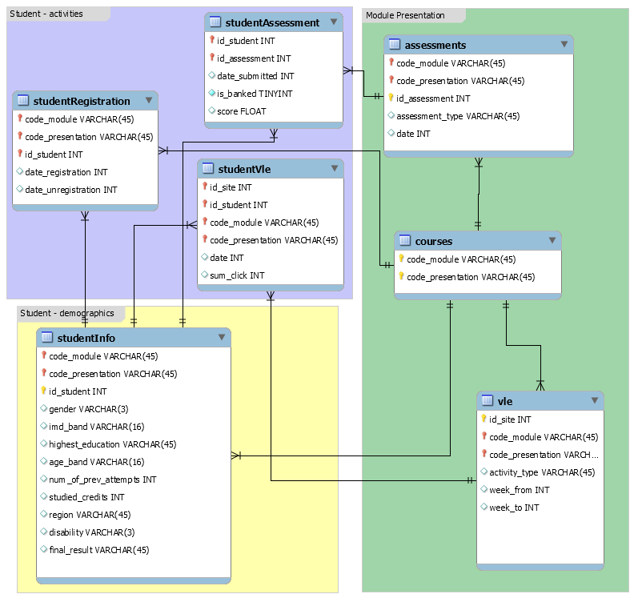

class: clear, title-slide, inverse, center, top, middle

```{r setup, include=FALSE}
knitr::opts_chunk$set(echo = FALSE)
```

```{r, echo=FALSE}
# then load all the relevant packages
pacman::p_load(pacman, knitr, tidyverse, readxl)
```

```{r xaringan-panelset, echo=FALSE}
xaringanExtra::use_panelset()
```

```{r xaringanExtra-clipboard, echo=FALSE}
# these allow any code snippets to be copied to the clipboard so they 
# can be pasted easily
htmltools::tagList(
  xaringanExtra::use_clipboard(
    button_text = "<i class=\"fa fa-clipboard\"></i>",
    success_text = "<i class=\"fa fa-check\" style=\"color: #90BE6D\"></i>",
  ),
  rmarkdown::html_dependency_font_awesome()
)
```
```{r xaringan-extras, echo=FALSE}
xaringanExtra::use_tile_view()

```

# `r rmarkdown::metadata$title`
----
### `r rmarkdown::metadata$author`
### `r format(Sys.time(), "%B %d, %Y")`

---

# Agenda

.panelset[

.panel[.panel-name[Discussion]

- 
- 
-
    
]

.panel[.panel-name[Conceptual Overview]

- 
- 
-

]

.panel[.panel-name[Coding Walkthrough]

- 
- 
- 

]
]

---

# Background

- We want to make predictions about an outcome of interest based on predictor variables that we think are related to the outcome. 
- We'll be using a widely-used data set in the learning analytics field:
the [Open University Learning Analytics Dataset
(OULAD)](https://analyse.kmi.open.ac.uk/open_dataset). 
- The OULAD was
created by learning analytics researchers at the United Kingdom-based
Open University. 
- It includes data from post-secondary learners
participation in one of several Massive Open Online Courses (called
*modules* in the OULAD).

---

# Agenda

.pull-left[
## Part 1: Core Concepts
### Prediction
- Prediction versus explanation
- Train and test set
]

.pull-right[

## Part 2: R Code Examples
### OULAD data
- Estimating a logistic regression model
- Interpreting the model in terms of its predictive accuracy
]

---

class: clear, inverse, center, middle

# Core Concepts

---

# What technique should I choose?

Do you have coded data or data with a known outcome -- let's say about K-12 students -- and, do you want to:

- _Predict_ how other students with similar data (but without a known outcome) perform?
- _Scale_ coding that you have done for a sample of data to a larger sample?
- _Provide timely or instantaneous feedback_, like in many learning analytics systems?

<bold><h4><center>Supervised methods may be your best bet</center></h4></bold>

---

# What technique should I choose?

Do you not yet have codes/outcomes -- and do you want to?

- _Achieve a starting point_ for qualitative coding, perhaps in a ["computational grounded theory"](https://journals.sagepub.com/doi/full/10.1177/0049124117729703) mode?
- _Discover groups or patterns in your data_ that may be of interest?
- _Reduce the number of variables in your dataset_ to a smaller, but perhaps nearly as explanatory/predictive - set of variables?

<bold><h4><center>Unsupervised methods may be helpful</center></h4></bold>

---

# Discussion

.pull-left[
### Turn to an elbow partner and discuss:

- Which modality (supervised or unsupervised machine learning) are you interested in using?
- What data or context are you interested in for your use of ML?
]

.pull-right[

```{r, echo = FALSE, out.width = "75%"}
knitr::include_graphics("img/joro-pointing.jpeg")
```
]

---

# Can we predict students' withdrawal from OULAD courses?

- Many students withdraw from these courses
- We have data on students' initial characteristics and their interactions in the course
- If we could develop a good prediction model, we could provide additional supports to students--and maybe move the needle on some students succeeding who might not otherwise

---

# OULAD

```{r, echo = FALSE}

```

---

# OULAD

We'll be focusing on three files:

- studentInfo, courses, and studentRegistration

These are joined together (see `oulad.R`) for this learning lab. You'll be doing more joining later!

```{r}
students <- read_csv("data/oulad-students.csv")
students %>% head(3)
```

---

class: clear, inverse, center, middle

# Code Examples

---

# Overview of classification modeling

These align with the LASER Framework (used across topic areas):

1.  **Prepare**: Prior to analysis, we'll take a look at the context
    from which our data came, formulate some questions, and load R packages.

2.  **Wrangle**: In the wrangling section, we will
    learn some basic techniques for manipulating, cleaning,
    transforming, and merging data.

3.  **Explore**: The processes of wrangling and exploring data often go hand in hand.

4.  **Model**: In this step, we carry out the analysis - here, supervised machine learning.

5.  **Communicate**: Interpreting and communicating the results of our findings is the last step
    
---

# Overview of classification modeling

1. **Split data** (Prepare)  
1. **Engineer features and write down the recipe** (Wrangle and Explore)  
1. **Specify the model and workflow** (Model)  
1. **Fit model** (Model)
1. **Evaluate accuracy** (Communicate)  

This is the basic process we'll follow for this and the next three learning labs focused on supervised ML

We'll dive into each of these subsequently

---

# Algorithm talk

- Algorithms (or estimation procedures - or informally models) refer to the _structure_ and _process_ of estimating the _parameters_ of a model

- This definition provides a wide range of options for what kinds of algorithms we use (from simple to very complex, as we discuss in a later learning lab)

- For now, we focus on a familiar, easy to interpret algorithm (e.g., [1](https://dl.acm.org/doi/abs/10.1145/3448139.3448154?casa_token=skmk5XGbDOUAAAAA:Z0Kl4nyjpOGFA6RuFTiiLWaC_KxH1vkQ72Kr0hetXcumRdvu8tPYlCX12AgHr9aS0Fp3L-Uu0p4), also [this](https://linkinghub.elsevier.com/retrieve/pii/S0895435618310813)), _logistic regression_
    - This is a linear model with a binary (*"yes"* or *"no"*) outcome
- It will be a _bad model_ to start us off!

---

# Classification modeling

.panelset[

.panel[.panel-name[0]

**Loading, setting up**

```{r, message = FALSE, warning = FALSE, echo = TRUE}
library(tidyverse)
library(tidymodels)

students <- read_csv("data/students-ss.csv")
```
]

.panel[.panel-name[1]

**Split data**

```{r panel-chunk-1, echo = TRUE, eval = FALSE}
train_test_split <- initial_split(students, prop = .80)

data_train <- training(train_test_split)
data_test <- testing(train_test_split)
```
]

.panel[.panel-name[2]

**Engineer features**

```{r panel-chunk-2, echo = TRUE, eval = FALSE}
my_rec <- recipe(withdrawn ~ disability + imd_band, data = data_train) # this is the key change and addition
```
]

.panel[.panel-name[3]

**Specify recipe, model, and workflow**
 
```{r panel-chunk-3, echo = TRUE, eval = FALSE}
# specify model
my_mod <-
    logistic_reg() %>% 
    set_engine("glm") %>%
    set_mode("classification")

# specify workflow
my_wf <-
    workflow() %>%
    add_model(my_mod) %>% 
    add_recipe(my_rec)
```
]

.panel[.panel-name[4]

**Fit model**

```{r panel-chunk-4, echo = TRUE, eval = FALSE}
fitted_model <- fit(my_wf, data = data_train)

final_fit <- last_fit(fitted_model, train_test_split)
```
]

.panel[.panel-name[5]

**Evaluate accuracy**

```{r panel-chunk-5, echo = TRUE, eval = FALSE}
final_fit %>%
    collect_metrics()
```
]
]

---

# In the remainder of this learning lab, you'll dive deeper

- **Case study**: You'll run all of this code, focusing on interpreting the predictions; walk through this slowly, as this is intended to be a gentle introduction to _all_ of the core parts of machine learning
- **Badge**: In the independent practice, you'll extend the model and also reflect and plan.

---
class: clear, center

## .font130[.center[**Thank you!**]]
<br/>
.center[<br/>**Dr. Joshua Rosenberg**<br/><mailto:jmrosenberg@utk.edu>]
