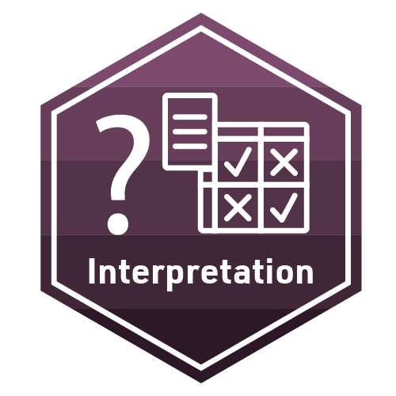

```{r setup, include=FALSE}
knitr::opts_chunk$set(echo = TRUE)
```

{width="30%"}

As a reminder, to earn a badge for these learning labs, you will have to respond to a set of prompts for several parts:

-   In *Part I*, you will reflect on your understanding of key concepts

-   In *Part II*, you will create a data product in R that demonstrates your ability to apply an analytic technique introduced in this learning lab.

### Part I: Data Product

For the data product, you will interpret a different type of model -- a model in a *regression* mode.

So far, we have specified and interpreted a *classification* model: one predicting a dichotomous outcome (i.e., whether students pass a course). In many cases, however, we are interested in predicting a continuous outcome (e.g., students' number of points in a course or their score on a final exam).

While many parts of the machine learning process are the same for a regression machine learning model, one key part that is relevant to this learning lab is different: their interpretation. The confusion matrix we created to parse the predictive strength of our classification model [does not pertain]{.underline} to regression machine learning models. Different metrics are used. For this badge activity, you will specify and interpret a regression machine learning model.

The requirements are as follows:

-   Change your outcome to **students' final exam performance** (note: check [the data dictionary](https://analyse.kmi.open.ac.uk/open_dataset) for a pointer!).

-   Using the same data (and testing and training data sets), recipe, and workflow as you used in the case study, **change the mode** of your model from classification to regression and change the **engine** from a glm to an lm model.

-   **Interpret your regression machine learning model** in terms of three regression machine learning model metrics: **MAE**, **MSE**, and **RMSE**. Read about these metrics [here](https://bradleyboehmke.github.io/HOML/process.html#model-eval). Similar to how we interpreted the classification machine learning metrics, focus on the substantive meaning of these statistics.

Please use the code chunk below for your code:

```{r}

```

Please add your interpretations here:

-   MAE:

-   MSE:

-   RMSE:

### Part II: Reflect and Plan

1.  What is an example of an outcome related to your research interests that could be modeled using a *classification* machine learning model?

-   

3.  What is an example of an outcome related to your research interests that could be modeled using a *regression* machine learning model?

-   

3.  Look back to the study you identified for the first machine learning learning lab badge activity. Was the outcome one that is modeled using a classification or a regression machine learning model? Identify which mode(s) the authors of that paper used and briefly discuss the appropriateness of their decision.

-   

---
title: 'Machine Learning - Learning Lab 1 Independent Practice'
author: ""
date: "`r format(Sys.Date(),'%B %e, %Y')`"
output: html_document
---

```{r setup, include=FALSE}
knitr::opts_chunk$set(echo = TRUE)
```

{width="30%"}

The final activity for each learning lab provides space to work with data and to reflect on how the concepts and techniques introduced in each lab might apply to your own research.

To earn a badge for each lab, you are required to respond to a set of prompts for two parts:

-   In Part I, you will extend our model by adding another variable.

-   In Part II, you will reflect on your understanding of key concepts and begin to think about potential next steps for your own study.

### Part I: Extending our model

In this part of the badge activity, please add another variable -- a variable for the number of days before the start of the module students registered. This variable will be a **third predictor**. By adding it, you'll be able to examine how much *more accurate* your model is (if at al, as this variable might not have great predictive power). Note that this variable is a number and so no pre-processing is necessary.

In doing so, please move all of your code needed to run the analysis over from your case study file here. This is essential for your analysis to be reproducible. You may wish to break your code into multiple chunks based on the overall purpose of the code in the chunk (e.g., loading packages and data, wrangling data, and each of the machine learning steps).

```{r}
library(tidyverse)
library(tidymodels)
library(janitor)

students <- read_csv("data/oulad-students.csv")
```

```{r}
students <- students %>% 
    mutate(pass = ifelse(final_result == "Pass", 1, 0)) %>% # creates a dummy code
    mutate(pass = as.factor(pass)) # makes the variable a factor, helping later steps

students <- students %>% 
    mutate(imd_band = factor(imd_band, levels = c("0-10%",
                                                  "10-20%",
                                                  "20-30%",
                                                  "30-40%",
                                                  "40-50%",
                                                  "50-60%",
                                                  "60-70%",
                                                  "70-80%",
                                                  "80-90%",
                                                  "90-100%"))) %>% # this creates a factor with ordered levels
    mutate(imd_band = as.integer(imd_band)) # this changes the levels into integers based on the order of the factor levels

students %>% 
    select(date_registration) # just taking a look at this variable
```

```{r}
set.seed(20230712)

train_test_split <- initial_split(students, prop = .80)
data_train <- training(train_test_split)

my_rec <- recipe(pass ~ disability + imd_band + date_registration, data = data_train) %>%  # this is the key change and addition!
    step_dummy(disability)

# specify model
my_mod <-
    logistic_reg() %>% 
    set_engine("glm") %>% # generalized linear model
    set_mode("classification") # since we are predicting a dichotomous outcome, specify classification; for a number, specify regression

my_wf <-
    workflow() %>% # create a workflow
    add_model(my_mod) %>% # add the model we wrote above
    add_recipe(my_rec) # add our recipe we wrote above

fitted_model <- fit(my_wf, data = data_train)

final_fit %>% 
    collect_metrics()
```

How does the accuracy of this new model compare? Add a few reflections below:

-   

### Part II: Reflect and Plan

Part A:

1.  How good was the machine learning model we developed in the badge activity? What if you read about someone using such a model as a reviewer of research? Please add your thoughts and reflections following the bullet point below.

-   

2.  How might the model be improved? Share any ideas you have at this time below:

-   

Part B: Use the institutional library (e.g. [NCSU Library](https://www.lib.ncsu.edu/#articles)), [Google Scholar](https://scholar.google.com/) or search engine to locate a research article, presentation, or resource that applies machine learning to an educational context aligned with your research interests. More specifically, **try to find a study like the one by Baker that interpets a statistic other than accuracy**. In gneeral, though, the goal is to find another relevant study (in the context of your research interests).

1.  Provide an APA citation for your selected study.

    -   

2.  What research questions were the authors of this study trying to address and why did they consider these questions important?

    -   

3.  What were the results of these analyses?

    -   

### Knit and Publish

Complete the following steps to knit and publish your work:

1.  First, change the name of the `author:` in the [YAML header](https://bookdown.org/yihui/rmarkdown-cookbook/rmarkdown-anatomy.html#yaml-metadata) at the very top of this document to your name. The YAML header controls the style and feel for knitted document but doesn't actually display in the final output.

2.  Next, click the knit button in the toolbar above to "knit" your R Markdown document to a [HTML](https://bookdown.org/yihui/rmarkdown/html-document.html) file that will be saved in your R Project folder. You should see a formatted webpage appear in your Viewer tab in the lower right pan or in a new browser window. Let's us know if you run into any issues with knitting.

3.  Finally, publish your webpage on Posit Cloud by clicking the "Publish" button located in the Viewer Pane after you knit your document. See screenshot below.

{width="80%"}

### Receiving Your Machine Learning Badge

To receive credit for this assignment and earn your second ML Badge, share the link to published webpage under the next incomplete badge artifact column on the 2023 LASER Scholar Information and Documents spreadsheet: <https://go.ncsu.edu/laser-sheet>. 

Once your instructor has checked your link, you will be provided a physical version of the badge below!

{width="30%"}
