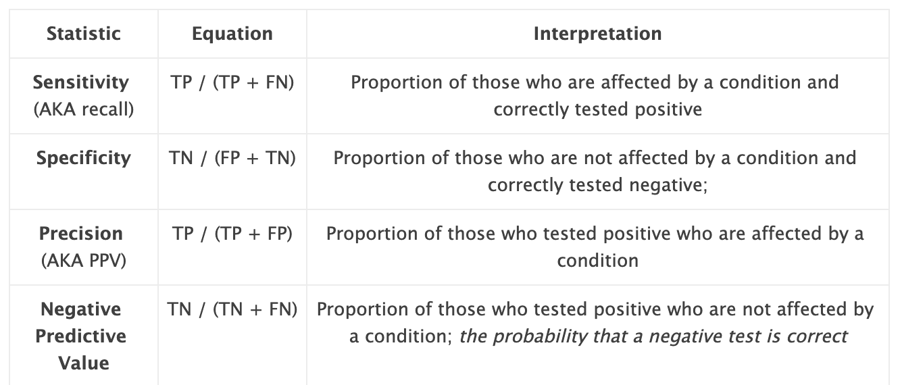

class: clear, title-slide, inverse, center, top, middle

```{r setup, include=FALSE}
knitr::opts_chunk$set(echo = FALSE, message = FALSE, warning = FALSE)
```

```{r, echo=FALSE}
# then load all the relevant packages
pacman::p_load(pacman, knitr, tidyverse, readxl)
```

```{r xaringan-panelset, echo=FALSE}
xaringanExtra::use_panelset()
```

```{r xaringanExtra-clipboard, echo=FALSE}
# these allow any code snippets to be copied to the clipboard so they 
# can be pasted easily
htmltools::tagList(
    xaringanExtra::use_clipboard(
        button_text = "<i class=\"fa fa-clipboard\"></i>",
        success_text = "<i class=\"fa fa-check\" style=\"color: #90BE6D\"></i>",
    ),
    rmarkdown::html_dependency_font_awesome()
)
```

```{r xaringan-extras, echo=FALSE}
xaringanExtra::use_tile_view()

```

# `r rmarkdown::metadata$title`
----
### `r rmarkdown::metadata$author`
### `r format(Sys.time(), "%B %d, %Y")`

---

# Purpose and Agenda

How do we interpret a machine learning model? What else can we say, besides how accurate a model this? This learning lab is intended to help you to answer these questions by examining output from a classification and a regression model. We again use the OULAD, but add an assessment file.

## What we'll do in this presentation

- Discussion 1
- Key Concept: Accuracy
- Key Concept: Feature Engineering (part A)
- Code-along
- Discussion 2
- Introduction to the other parts of this learning lab

---

# Discussion 1

.panelset[

.panel[.panel-name[Background]

- We are likely familiar with _accuracy_ and maybe another measure, _Cohen's Kappa_
- But, you may have heard of other means of determining how good a model is at making predictions: confusion matrices, specificity, sensitivity, recall, AUC-ROC, and others
- Broadly, these help us to understand _for which cases and types of cases a model is predictively better than others_ in a finer-grained way than accuracy

]

.panel[.panel-name[Getting Started]

Think broadly and not formally (yet): What makes a prediction model a good one?

]

.panel[.panel-name[Digging Deeper]

- After having worked through the first learning lab, have your thoughts on what data you might use for a machine learning study evolved? If so, in what ways? If not, please elaborate on your initial thoughts and plans.

]
]

---


# Key Concept: Accuracy

.panelset[

.panel[.panel-name[Accuracy]

Let's start with accuracy and a simple confusion matrix; what is the **Accuracy**?

```{r, echo = FALSE, message = FALSE, out.}
readr::read_csv("data/sample-table.csv") %>% 
    slice(1:5) %>% 
    knitr::kable()
```

]

.panel[.panel-name[Accuracy]

Use the `tabyl()` function (from {janitor} to calculate the accuracy in the code chunk below.

```{r}
library(janitor)

data_for_conf_mat <- tibble(Outcome = c(1, 0, 0, 1, 1),
                            Prediction = c(1, 0, 1, 0, 1)) %>% 
    mutate_all(as.factor)
```

```{r, eval = TRUE, echo = TRUE}
data_for_conf_mat %>% 
    mutate(correct = Outcome == Prediction) %>% 
    tabyl(correct)
```

]


.panel[.panel-name[Conf Mat]

Now, let's create a confusion matrix based on this data:

.code80.remark-code[
```{r}
library(tidymodels)

data_for_conf_mat %>% 
    conf_mat(Outcome, Prediction)
```
]
]


.panel[.panel-name[Conf Mat]

You can think of the following statistics as slicing and dicing the confusion matrix you created above, revealing insights in the process.

**Accuracy**: Proportion of the population that is true positive or true negative

**True positive (TP)**: Proportion of the population that is affected by a condition and correctly tested positive

**True negative (TN)**: Proportion of the population that is not affected by a condition and correctly tested negative

**False positive (FP)**: Proportion of the population that is not affected by a condition and incorrectly tested positive

**False negative (FN)**: Proportion of the population that is affected by a condition and incorrectly tested positive.

]


.panel[.panel-name[Conf Mat]


]


.panel[.panel-name[Metrics]




]


]

---

# Key Concept: Feature Engineering (Part A)
.panelset[

.panel[.panel-name[Why?]

Let's consider a very simple data set, `d`, one with _time_point_ data, `var_a`, for a single student. How do we add this to our model?

```{r, include = FALSE}
d <- tibble(student_id = "janyia", time_point = 1:10, var_a = c(0.01, 0.32, 0.32, 0.34, 0.04, 0.54, 0.56, 0.75, 0.63, 0.78))
```

```{r}
d %>% head(3)
```

]

.panel[.panel-name[Why?]

```{r, out.width="30%"}
d %>% 
    ggplot(aes(x = time_point, y = var_a)) +
    geom_point()
```

]


.panel[.panel-name[How?]

- We can do all of these things **manually**
- But, there are also helpful "**{recipes}**" functions to do this
- Any, the {recipes} package makes it practical to carry out feature engineering steps for not only single variables, but groups of variables (or all of the variables)
- Examples, all of which start with `step()`, e.g. `step_dummy()`

]
]


---

# AUC-ROC

- Informs us as to how the True Positive rate changes given a different classification threshhold
- Classification threshhold: the probability above which a model makes a positive prediction
- Higher is better

---

# Code-along

.panelset[

.panel[.panel-name[0]

**Loading, setting up: create a .R file in /lab-1 and run this code**

```{r, eval = FALSE, echo = TRUE}
library(tidyverse)
library(tidymodels)

starwars_recoded <- starwars %>% # built-in data available just by typing
    mutate(species_human = ifelse(species == "Human", 1, 0), # recoding species to create a 0-1 outcome 
           species_human = as.factor(species_human)) # changing to a factor

starwars_recoded %>% 
    count(species) # how many humans are there?
```

]

.panel[.panel-name[1]

**Split data**

```{r, echo = TRUE, eval = FALSE}
train_test_split <- initial_split(starwars_recoded, prop = .80)

data_train <- training(train_test_split)
data_test <- testing(train_test_split)
```

]

.panel[.panel-name[2]

**Engineer features**

```{r, echo = TRUE, eval = FALSE}
# predicting humans based on the variables we used in LL1 + birth_year and homeworld
my_rec <- recipe(species_human ~ height + mass + birth_year + eye_color, data = data_train)
```

]

.panel[.panel-name[3]

**Specify recipe, model, and workflow**

```{r, echo = TRUE, eval = FALSE}
my_mod <-
    logistic_reg() %>% 
    set_engine("glm") %>%
    set_mode("classification")

my_wf <-
    workflow() %>%
    add_model(my_mod) %>% 
    add_recipe(my_rec) %>% 
    step_dummy(eye_color) # need to dummy code
```

]

.panel[.panel-name[4]

**Fit model**

```{r, echo = TRUE, eval = FALSE}
fitted_model <- fit(my_wf, data = data_train) # ignore warning for this example
class_metrics <- metric_set(accuracy, sensitivity, specificity, ppv, npv, kap) # this is new
final_fit <- last_fit(fitted_model, train_test_split)
```

]

.panel[.panel-name[5]

**Evaluate accuracy**

```{r, echo = TRUE, eval = FALSE}
final_fit %>%
    collect_metrics()
```

]

.panel[.panel-name[6]

**Aside**: Joins!

```{r, echo = TRUE, eval = FALSE}
band_members %>% left_join(band_instruments)
band_members %>% inner_join(band_instruments)
```

]


]

---

# Discussion 2

.panelset[

.panel[.panel-name[Reflecting]

- Which metrics for supervised machine learning models (in classification "mode") are important to interpret? Why?

]

.panel[.panel-name[Applying]

- Thinking broadly about your research interest, what would you need to consider before using a supervised machine learning model? Consider not only model metrics but also the data collection process and how the predictions may be used.

]

]

---

# Introduction to the other parts of this learning lab

.panelset[

.panel[.panel-name[Reading]

Baker, R. S., Berning, A. W., Gowda, S. M., Zhang, S., & Hawn, A. (2020). Predicting K-12 dropout. *Journal of Education for Students Placed at Risk, 25*(1), 28-54.

]

.panel[.panel-name[Case Study]

- Adding another data source from the [OULAD](https://analyse.kmi.open.ac.uk/open_dataset), assessments data
- Interpreting each of the metrics in greater detail
- Using `metric_set`

]

.panel[.panel-name[Badge]

- Adding still another variable
- Stepping back and interpreting the model as a whole
- Finding another relevant study 

]
]

---

# *fin*

We hope to see you in the ML topic area learning labs!

- *Dr. Joshua Rosenberg* (jmrosenberg@utk.edu; https://joshuamrosenberg.com)
- *Dr. Peng  He* (hepeng1@msu.edu)

[These slides (Introductory Presentation)](https://laser-institute.github.io/machine-learning/introductory-presentation.html#1)

[General troubleshooting tips for R and RStudio](https://docs.google.com/document/d/14Jc-KG3m5k1BvyKWqw7KmDD21IugU5nV5edfJkZyspY/edit)
