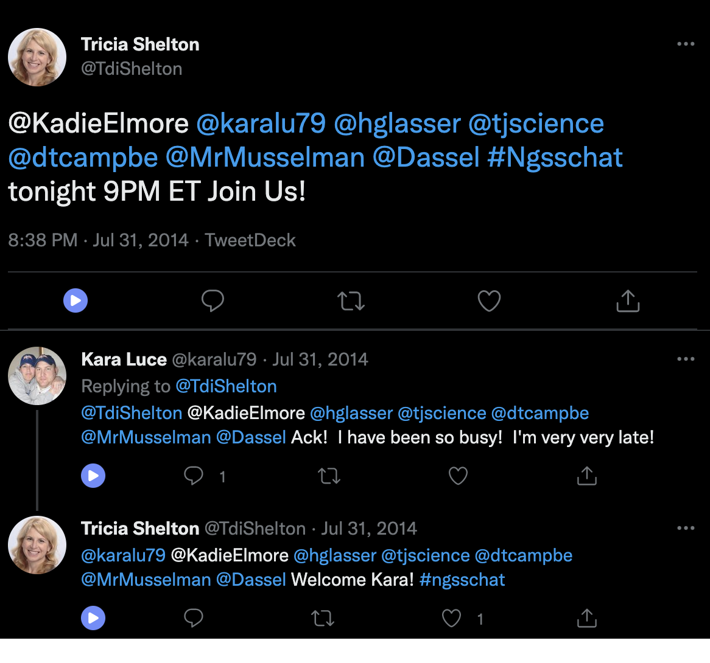

class: clear, title-slide, inverse, center, top, middle

```{r setup, include=FALSE}
knitr::opts_chunk$set(echo = FALSE)
```

```{r, echo=FALSE}
# then load all the relevant packages
pacman::p_load(pacman, knitr, tidyverse, readxl)
```

```{r xaringan-panelset, echo=FALSE}
xaringanExtra::use_panelset()
```

```{r xaringanExtra-clipboard, echo=FALSE}
# these allow any code snippets to be copied to the clipboard so they 
# can be pasted easily
htmltools::tagList(
  xaringanExtra::use_clipboard(
    button_text = "<i class=\"fa fa-clipboard\"></i>",
    success_text = "<i class=\"fa fa-check\" style=\"color: #90BE6D\"></i>",
  ),
  rmarkdown::html_dependency_font_awesome()
)
```
```{r xaringan-extras, echo=FALSE}
xaringanExtra::use_tile_view()

```

# `r rmarkdown::metadata$title`
----
### `r rmarkdown::metadata$author`
### `r format(Sys.time(), "%B %d, %Y")`

---

# Background

- W are interested in using one year of coded data to train a computer to be able to code a second year's worth of data
    - here, our aim is to scale an existing set of coded data 
    - driving question: how is the aim of prediction different from explanation?
    - core idea: train and test set of data

We'll focus on a logistic regression model - no more, and no less

---

# Agenda

.pull-left[
## Part 1: Core Concepts
- Prediction versus explanation
- Train and test set
]

.pull-right[

## Part 2: R Code Examples
- Estimating a logistic regression model
- Interpreting the model in terms of its predictive accuracy
]

---

class: clear, inverse, center, middle

# Core Concepts

---

# A brief review

What are the differences between supervised and unsupervised machine learning?

---

# Supervised & unsupervised

## Supervised ML

- Requires coded data or data with a known outcome
- Uses coded/outcome data to train an algorithm
- Uses that algorithm to **predict the codes/outcomes for new data** (data not used during the training)
- Can take the form of a *classification* (predicting a dichotomous or categorical outcome) or a *regression* (predicting a continuous outcome)
- Algorithms include:
  - [Linear regression (really!)](https://web.stanford.edu/~hastie/ElemStatLearn/)
  - Logistic regression
  - Decision tree
  - Support Vector Machine

---

# What kind of coded data?

> Want to detect spam? Get samples of spam messages. Want to forecast stocks? Find the price history. Want to find out user preferences? Parse their activities on Facebook (no, Mark, stop collecting it, enough!) (from [ML for Everyone](https://vas3k.com/blog/machine_learning/))

In educational research:

- Assessment data (e.g., [1](https://link.springer.com/article/10.1007/s10956-020-09895-9))
- Data from log files ("trace data") (e.g., [1](https://www.tandfonline.com/doi/full/10.1080/10508406.2013.837391?casa_token=-8Fm2KCFJ30AAAAA%3Altbc8Y8ci_z-uLJx4se9tgvru9mzm3yqCTFi12ndJ5uM6RDl5YJGG6_4KpUgIK5BYa_Ildeh2qogoQ))
- Open-ended written responses (e.g., [1](https://link.springer.com/article/10.1007/s10956-020-09889-7), [2](https://doi.org/10.1007/s11423-020-09761-w))
- Achievement data (i.e., end-of-course grades) (e.g., [1](https://link.springer.com/article/10.1007/s10956-020-09888-8), [2](https://search.proquest.com/docview/2343734516?pq-origsite=gscholar&fromopenview=true))

What else?
- Drawings/diagrammatic models
- Data collected for formative purposes (i.e., exit tickets)
- ???

---

# How is this different from regression?

The _aim_ is different, the algorithms and methods of estimation are not (or, are differences in degree, rather than in kind).

In a linear regression, our aim is to estimate parameters, such as $\beta_0$ (intercept) and $\beta_1$ (slope), and to make inferences about them that are not biased by our particular sample.

In an ML approach, we can use the same linear regression model, but with a goal other than making unbiased inferences about the $\beta$ parameters:

<h4><center>In supervised ML, our goal is to minimize the difference between a known $y$ and our predictions, $\hat{y}$</center></h3>

---

# A helpful frame 

## Unsupervised ML

- Does not require coded data; one way to think about unsupervised ML is that its purpose is to discover codes/labels
- Is used to discover groups among observations/cases or to summarize across variables
- Can be used in an _exploratory mode_ (see [Nelson, 2020](https://journals.sagepub.com/doi/full/10.1177/0049124118769114?casa_token=EV5XH31qbyAAAAAA%3AFg09JQ1XHOOzlxYT2SSJ06vZv0jG-s4Qfz8oDIQwh2jrZ-jrHNr7xZYL2FwnZtZiokhPalvV1RL2Bw)) 
- **Warning**: The results of unsupervised ML _cannot_ directly be used to provide codes/outcomes for supervised ML techniques 
- Can work with both continuous and dichotomous or categorical variables
- Algorithms include:
  - Cluster analysis
  - [Principle Components Analysis (really!)](https://web.stanford.edu/~hastie/ElemStatLearn/)
  - Latent Dirichlet Allocation (topic modeling)

---

# What technique should I choose?

Do you have coded data or data with a known outcome -- let's say about K-12 students -- and, do you want to:

- _Predict_ how other students with similar data (but without a known outcome) perform?
- _Scale_ coding that you have done for a sample of data to a larger sample?
- _Provide timely or instantaneous feedback_, like in many learning analytics systems?

<bold><h4><center>Supervised methods may be your best bet</center></h4></bold>

---

# What technique should I choose?

Do you not yet have codes/outcomes -- and do you want to?

- _Achieve a starting point_ for qualitative coding, perhaps in a ["computational grounded theory"](https://journals.sagepub.com/doi/full/10.1177/0049124117729703) mode?
- _Discover groups or patterns in your data_ that may be of interest?
- _Reduce the number of variables in your dataset_ to a smaller, but perhaps nearly as explanatory/predictive - set of variables?

<bold><h4><center>Unsupervised methods may be helpful</center></h4></bold>

---

# What if we want to *scale* a coding frame?

In a recent study, I was interested in whether the conversation was meaningful or more superficial

With colleagues, I coded a large number of tweets to the #NGSSchat community ([Rosenberg et al., 2020](https://scholar.google.com/scholar?hl=en&as_sdt=0%2C43&q=NGSSchat&btnG=))

We used a coding frame from [van Bommel et al. (2020)](https://www.sciencedirect.com/science/article/pii/S0742051X19300629):

- Transactional: A transactional interaction refers to those in which participation or learning is acknowledged.
- Substantive: Discussions of NGSS- and science education-related content.
- Transformational: Reflections or exhibitions of an individual's change in knowledge or practice 

---

# Let's look at a few examples

`id_string`: 46

```{r, out.width="40%"}
knitr::include_graphics("img/ngsschat-example-tweets_1.png")
```

We coded this as *substantive*

---

# Let's look at a few examples

`id_string`: 30

```{r, out.width="40%"}
knitr::include_graphics("img/ngsschat-example-tweets_2.png")
```

We coded this as *transactional*

---

# Let's look at a few examples

`id_string`: 45

```{r, out.width="40%"}
knitr::include_graphics("img/ngsschat-example-tweets_3.png")
```

We coded this as *substantive*

---

# Let's look at a few examples

`id_string`: 2

```{r, out.width="40%"}

```

We coded this as *transactional*

---

# Can we scale up?

There are *hundreds of thousands* of tweets like this in threads; practically, there's no way we could code all of them.

But, we did code several thousand threads

Can we use these to scale up our coding?

In other words, can the computer use the features of tweets in threads to assign them labels as *transactional* or *substantive* conversations?

---
# How do I select a model?

One general principle is to **start with the simplest useful model** and to _build toward
more complex models as helpful_.

This principle applies in multiple ways:

- To choose an algorithm, start with simpler models that you can efficiently use and understand
- To carry out feature engineering, understand your predictors well by starting with a subset
- To tune an algorithm, start with a relatively simple set of tuning parameters

This isn't just for beginners or those of us in education; [most spam filters use Support Vector Machines (and used Naive Bayes until recently)](https://vas3k.com/blog/machine_learning/) due to their combination of effectiveness and efficiency "in production."

---

# Super complex?

- Nothing too much, apart from computing power, time, and concerns of 
- A "check" on your work is your predictions on _test_ set data
  - *Train data*: Coded/outcome data that you use to train ("estimate") your model
  - *Validation data<sup>1</sup>*: Data you use to select a particular algorithm
  - *Test ("hold-out") data*: Data that you do not use in any way to train your data

- An important way to achieve good performance with test data is to balance between the inherent _bias_ in your algorithm and the _variance_ in the predictions of your algorithm; this is referred to as the **bias-variance** trade-off of _all_ models

.footnote[
[1] not always/often used, for reasons we'll discuss later

]

---

class: clear, inverse, center, middle

# Code Examples

---

# Overview of classification modeling

1. Split data
1. Engineer features
1. Specify recipe, model, and workflow
1. Fit model
1. Evaluate accuracy

This is the basic process we'll follow for this and the next three learning labs

---

# Algorithm talk

- Algorithms (or estimation procedures - or informally models) refer to the _structure_ and _process_ of estimating the _parameters_ of a model

- This definition provides a wide range of options for what kinds of algorithms we use (from simple to very complex, as we discuss in a later learning lab)

- For now, we focus on a familiar, easy to interpret algorithm, one that is still often used in sophisticated, rigorous analyses (e.g., [1](https://ieeexplore.ieee.org/stamp/stamp.jsp?arnumber=7373578&casa_token=xqYfYUtB7Y8AAAAA:Hv9EY3EnDjdtCt1chhsO6cLP_QYcxRSdYQGNzZWTJfkdA2BlDUK5ZekrMqJjobJLj_mUDiQ&tag=1), [2](https://dl.acm.org/doi/abs/10.1145/3448139.3448154?casa_token=skmk5XGbDOUAAAAA:Z0Kl4nyjpOGFA6RuFTiiLWaC_KxH1vkQ72Kr0hetXcumRdvu8tPYlCX12AgHr9aS0Fp3L-Uu0p4), also [this](https://linkinghub.elsevier.com/retrieve/pii/S0895435618310813)), _logistic regression_
    - This is a linear model with a binary ("yes" or "no") outcome

---

.panelset[

.panel[.panel-name[1]

**Split data**

```{r panel-chunk-1, echo = TRUE, eval = FALSE}
train_test_split <- initial_split(ddd, prop = .70)

data_train <- training(train_test_split)
data_test <- testing(train_test_split)
```
]

.panel[.panel-name[2]

**Engineer features**

```{r panel-chunk-2, echo = TRUE, eval = FALSE}
my_rec <- recipe(code ~ ., data = ddd) %>% 
    step_normalize(all_numeric_predictors()) %>%
    step_nzv(all_predictors())
```
]

.panel[.panel-name[3]

**Specify recipe, model, and workflow**
 
```{r panel-chunk-3, echo = TRUE, eval = FALSE}
# specify model
rf_mod_many <-
    logistic_reg() %>% 
    set_engine("glm") %>%
    set_mode("classification") %>%  # note this
    step_impute_knn(all_predictors(), all_outcomes())

# specify workflow
rf_wf_many <-
    workflow() %>%
    add_model(rf_mod_many) %>% 
    add_recipe(my_rec)
```
]

.panel[.panel-name[4]

**Fit model**

```{r panel-chunk-4, echo = TRUE, eval = FALSE}
tree_res <- fit(rf_wf_many, data = data_train)

predict(tree_res, data_test)

final_fit <- last_fit(tree_res, train_test_split,
               metrics = metric_set(roc_auc, accuracy, kap, 
                                                    sensitivity, specificity, precision))
```
]

.panel[.panel-name[5]

**Evaluate accuracy**

```{r panel-chunk-5, echo = TRUE, eval = FALSE}
# fit stats
final_fit %>%
    collect_metrics()

# confusion matrix
final_fit$.predictions[[1]] %>% 
    conf_mat(.pred_class, code)
```
]
]

---

# Let's see how the model did

`id_string`: 46

```{r, out.width="40%"}
knitr::include_graphics("img/ngsschat-example-tweets_1.png")
```

We coded this as *substantive*
The model predicted: *substantive* **correct!**

---

# Let's see how the model did

`id_string`: 30

```{r, out.width="40%"}
knitr::include_graphics("img/ngsschat-example-tweets_2.png")
```

We coded this as *transactional*
The model predicted: *substantive* **correct!**

---

# Let's see how the model did

`id_string`: 45

```{r, out.width="40%"}
knitr::include_graphics("img/ngsschat-example-tweets_3.png")
```

We coded this as *substantive*
The model predicted: *transactional* **incorrect; why?**

---

# Let's see how the model did

`id_string`: 2

```{r, out.width="40%"}

```

We coded this as *transactional*
The model predicted: *substantive* **incorrect; why?**

---

# In the remainder of this learning lab, you'll dive deeper into this model

- **Guided walkthrough**: You'll run all of this code, focusing on interpreting the predictions
- **Independent practice**: In the independent practice, you'll focus on interpreting the fit measures (agreement, Kappa, and others)
- **Readings**: There are two readings, one closely related to the guided walkthrough, the other an example of using supervised machine learning like used here for assessment purposes

---
class: clear, center

## .font130[.center[**Thank you!**]]
<br/>
.center[<br/>**Dr. Joshua Rosenberg**<br/><mailto:jmrosenberg@utk.edu>]
